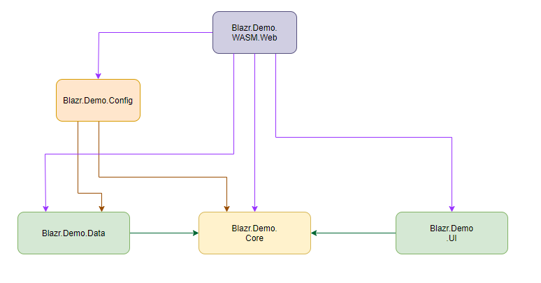

# A Clean Design Template for Blazor

>> Work in Progress
>> Incomplete

## Overview

My reasons for building an alternative to the standard out-of-the-box templates are as follows:

1. They imply that you need to choose at the onset between Server and WASM modes, and that the code base of each is different.
2. `FetchData` demonstrates poor design and gets used as the template for the first project many do after an intial play.
3. They mix real pages and routes and call them all pages. 

## Code and Examples

## Clean Design

The basic premise of Clean Design is to separate an application into a set of domains, with the main business and application logic separated from data storage and presentation.

The basic architecture of the solution splits the application codebase into three domains:

1. **Data Domain** - all code relating to data management.
2. **Core domain** - this is the core application code the business and logical layers of an application.  It has no dependancies on other solution projects.
3. **UI Domain** - this contains all the UI component code.


There are two other support **Domains**:

1. **Controller Domain** - the API controller code.  This is strictly not Blazor Code.  It's standard server side DotNetCore.
2. **Config Domain** - contains configuration data for the solution and the Web projects.

The solution is structured as a set of projects with defined dependancies to enforce the design.

The solution projects are:

Within the project this translates into the following projects:

1. **.Core** - *Microsoft.NET.Sdk* SDK - Contains all the Core Domain code.  No internal project dependancies.
2. **.Data** - *Microsoft.NET.Sdk* SDK - Contains all the Data Domain code.  Only dependancy is on *.Core*.
3. **.UI** - *Microsoft.NET.Sdk.Razor* SDK - contains all the UI component code.  Only Dependancy is on *.Core*.
4. **.Config** - *Microsoft.NET.Sdk.Razor* SDK - contains the application xconfiguration code and the `IServiceCollection` extension methods.   Dependancies are *.Core* and *.Data*.
5. **.Controller** - *Microsoft.NET.Sdk* SDK - contains the API controllers. Normal Dependancy is *.Core*.  Should interface with the data domain through the same interfaces as used by the core.
6. **.Server.Web** - *Microsoft.NET.Sdk.Web* SDK - The Web Server project to run the Server SPA.
7. **.WASM** - *Microsoft.NET.Sdk.BlazorWebAssembly* SDK - the project to build and bundle the WASM codebase.
8. **.WASM.Web** - *Microsoft.NET.Sdk.Web* SDK - The Web Server project to host the WASM SPA and run the WASM API Controllers.
9. **.Tests** - *Microsoft.NET.Sdk* SDK - The XUnit/BUnit test project.

### Server SPA/Web Dependancies



### WASM SPA/Web Dependancies


## Core Project

The Core project has **NO** dependancies on other solution projects.  In this simple implementation it contains three files.

`WeatherForecast` is the same class as in the original templates, but has changed to a `record`.  So how do you edit a record?  If you wish to edit an item, you create a edit object.  It contains:
1. The values you want to edit 
2. Logic to track data state 
3. Validation
4. Methods to create a record to submit back to the data store

`WeatherForecast` belongs in the core because it's part of your application, and used in all three domains.  This solution implements a `DboWeatherForecast` data object for the Data domain to demonstrate how to deal with differences between the database stored entity and your application entity.

`IWeatherForecastDataBroker` is the interface that defines how the Core domain talks to the Data domain.  All Core to Data domain connections are through the interface.  The DI service is defined using this interface.

```csharp
// The Blazor Server IWeatherForecastDataBroker Service
services.AddSingleton<IWeatherForecastDataBroker, WeatherForecastServerDataBroker>();

// The Blazor WASM IWeatherForecastDataBroker Service
services.AddScoped<IWeatherForecastDataBroker, WeatherForecastAPIDataBroker>();
```

`WeatherForecastViewService` is the "interface" the UI domain uses to access WeatherForecast data.  It maintains the current record sets the UI is using and the state of those record sets.  It interfaces with the Data domain through the `IWeatherForecastDataBroker`.

```csharp
private readonly IWeatherForecastDataBroker? weatherForecastDataBroker;

public List<WeatherForecast>? Records { get; private set; }

public WeatherForecastViewService(IWeatherForecastDataBroker weatherForecastDataBroker)
    => this.weatherForecastDataBroker = weatherForecastDataBroker!;
```

  It implements the *Notification* pattern for recordset state:

```csharp
public event EventHandler<EventArgs>? ListChanged;

public void NotifyListChanged(object? sender, EventArgs e)
            => ListChanged?.Invoke(sender, e);
```
Used here:

```csharp
public async ValueTask GetForecastsAsync()
{
    // Do the null step with notification so that the UI can display a Loading message if we have a slow connection
    this.Records = null;
    this.NotifyListChanged(this.Records, EventArgs.Empty);
    this.Records = await weatherForecastDataBroker!.GetWeatherForecastsAsync();
    this.NotifyListChanged(this.Records, EventArgs.Empty);
}
```

## Data Project

The Data project has one project dependancy - the Core project.

It implements the data layers required to talk to the data stores/external data services.

`DboWeatherForecast` is the data entity object that is retrieved from the data store.  In addition to the data it contains two methods to convert from and to the apllication `WeatherForecast` data object.  Why not just use `WeatherForecast` throughout?  Change our data source to a data file where the Guid and Date is stored as strings.  Our DboWeatherForecast then has those fields defined as strings and our `WeatherForecast` convertion methods do the necessary type conversions.  We could implement all this in `WeatherForecast`, but then we are linking Core domain code to the Data domain implementation.

`WeatherForecastDataStore` is the data store for the application.  It would normally be replaced with an Entity Framework or other data service access layer.  It builds a dataset internally and provides copies to the public methods.  `CreateTestForecasts` and `OverrideWeatherForecastDataSet` are provided for testing and used in the Test projects.

`WeatherForecastServerDataBroker` and `WeatherForecastAPIDataBroker` are two implementations of `IWeatherForecastDataBroker`.  `WeatherForecastServerDataBroker` is used as the `IWeatherForecastDataBroker` service in the Blazor Server Web project and Blazor WASM Web project.  `WeatherForecastAPIDataBroker` is used in the Blazor WASM project that builds the WASM SPA code.

## UI Project

The UI project has one project dependancy - the Core project.

This project is where the majority of the out-of-the-box template code resides.

1. *Apps* contains `App`.
2. *Shared* contains the same `MainLayout`, `NavMenu` and `SurveyPrompt` razor components.
3. *Routes* contains `Index`, `Counter`, `FetchData` and `Rendering` route components.
4.  *Components* contains two new razor components - `WeatherForecastList` and `WeatherForecastListHeader`.

First, *Pages*.  I separate out real web pages from Blazor "pages".  Blazor "pages" aren't really pages at all.  They are components for defined routes within the application.  I call them Routes, so that's what I call the directory where they reside.  In general you need to stop thinking of them as web pages.  There are too many attributes of web pages that don't apply to routes.  It's very easy for people new to SPAs to get confused!

All the razor components have `namespace` declarations to make it easy to reference them.

```html
@page "/"
@namespace Blazr.Demo.UI

<PageTitle>Index</PageTitle>
<h1>Hello, world!</h1>
Welcome to your new app.
<SurveyPrompt Title="How is Blazor working for you?" />
```

`WeatherForecastList` is a lift of the majority of the code from `FetchData` into a separate component.  Note:

1. It injects the `WeatherForecastViewService` and uses the data sets in the View service.  It holds no local copies.
2. It makes use of the Notification pattern to react to changes in record set in the `WeatherForecastViewService`.  It registers `OnListChanged` with the view service `ListChanged` event, and renders the component on the event.
3. It implements `IDisposable` to handle de-registering the event handler.

`WeatherForecastHeader` displays the title with the record count and demonstrates using the Notification pattern to keep the record count display in sync.

`Rendering` is a demo page to demonstrate how to code Blazor Component events.

## Config Project

The Config project holds configuration information for the solution.  Here it holds a single file `IServiceCollectionExtensions.cs` which adds extensions to the `IServiceCollection` for the different service configurations.  Keeping them all in one place, rather than in each project makes them more manageable.  There's one method per configuration. 

## Controllers Project

The Controllers project contains all the API controllers.  We have one, `WeatherForecastController`.

This injects the configured `IWeatherForecastDataBroker` to access the Data Domain.

```csharp
private IWeatherForecastDataBroker weatherForecastDataBroker;

public WeatherForecastController(IWeatherForecastDataBroker weatherForecastDataBroker)
    => this.weatherForecastDataBroker = weatherForecastDataBroker;

[Route("/api/weatherforecast/list")]
[HttpGet]
public async Task<List<WeatherForecast>> GetForecastAsync()
    => await weatherForecastDataBroker.GetWeatherForecastsAsync();

```

## WASM Project

The WASM project is where the WASM code gets compiled and packaged.  The only files are the *wwwroot* file structure from the out-of-the-box template and `Program` which defines how the WASM SPA starts.

```csharp
var builder = WebAssemblyHostBuilder.CreateDefault(args);
// The start up App with it's full namespace to show where it's coming from
builder.RootComponents.Add<Blazr.Demo.UI.App>("#app");
builder.RootComponents.Add<HeadOutlet>("head::after");
var services = builder.Services;
// The IServiceCollection extension method for the WASM SPA
services.AddAppBlazorWASMServices();

builder.Services.AddScoped(sp => new HttpClient { BaseAddress = new Uri(builder.HostEnvironment.BaseAddress) });

await builder.Build().RunAsync();
```

## The Web Projects

A Blazor Server or WASM Server is just another standard AspNetCore web project.  What differentiates them are the configured services and middleware.

### WASM.Web

This has two jobs:
1. 
